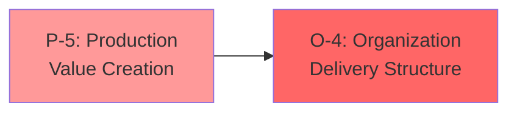
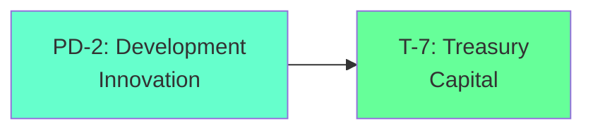
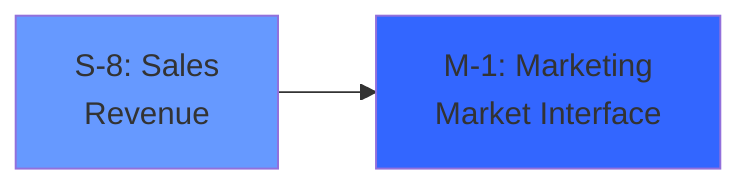
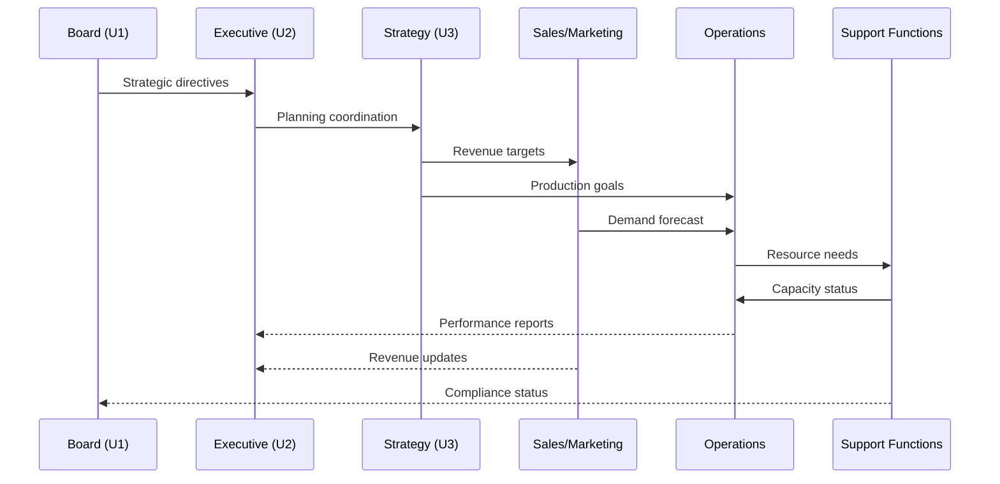

# cosys-org

## Cosmos System Model Applied to Business Organization & Enterprise Ecosystems

This repository implements the **Cosmos System 5** triadic architecture mapped to organizational structures, business functions, and enterprise ecosystems, providing a comprehensive framework for understanding and modeling organizations as self-organizing cognitive systems.

---

## Overview

**cosys-org** translates the Cosmos System's triadic polarity structure into an organizational model that treats enterprises as living cognitive systems. The framework implements the **18-service [[D-T]-[P-O]-[S-M]] pattern** mapped to business functions, departments, and organizational dynamics.

### Core Mapping: Organization as Cognitive Triad

```
┌─────────────────────────────────────────────────────────────────────────────┐
│                    COSYS-ORG: ORGANIZATIONAL COSMOS SYSTEM                  │
├─────────────────────────────────────────────────────────────────────────────┤
│                                                                             │
│   ┌─────────────────────────────────────────────────────────────────────┐   │
│   │                    CEREBRAL TRIAD [3]                               │   │
│   │                    Executive Functions - Strategic Level            │   │
│   │                    Potential Topology                               │   │
│   ├─────────────────────────────────────────────────────────────────────┤   │
│   │  T-7: Treasury/Finance     │  PD-2: Development/R&D               │   │
│   │  Resource Potential        │  Innovation Coordination              │   │
│   │  Capital Management        │  Strategic Planning                   │   │
│   ├────────────────────────────┼────────────────────────────────────────┤   │
│   │  P-5: Production/Ops       │  O-4: Organization/Admin              │   │
│   │  Value Creation            │  Structural Coordination              │   │
│   │  Process Execution         │  Policy Implementation                │   │
│   └─────────────────────────────────────────────────────────────────────┘   │
│                                    │                                        │
│                                    ▼                                        │
│   ┌─────────────────────────────────────────────────────────────────────┐   │
│   │                    SOMATIC TRIAD [6]                                │   │
│   │                    Operational Functions - Tactical Level           │   │
│   │                    Commitment Topology                              │   │
│   ├─────────────────────────────────────────────────────────────────────┤   │
│   │  M-1: Marketing            │  S-8: Sales                           │   │
│   │  Market Interface          │  Revenue Generation                   │   │
│   │  Brand Management          │  Customer Acquisition                 │   │
│   ├────────────────────────────┼────────────────────────────────────────┤   │
│   │  P-5: Production           │  O-4: Operations                      │   │
│   │  Manufacturing             │  Delivery & Fulfillment               │   │
│   │  Service Delivery          │  Quality Assurance                    │   │
│   └─────────────────────────────────────────────────────────────────────┘   │
│                                    │                                        │
│                                    ▼                                        │
│   ┌─────────────────────────────────────────────────────────────────────┐   │
│   │                    AUTONOMIC TRIAD [9]                              │   │
│   │                    Support Functions - Operational Level            │   │
│   │                    Performance Topology                             │   │
│   ├─────────────────────────────────────────────────────────────────────┤   │
│   │  M-1: Monitoring/Audit     │  S-8: State/HR                        │   │
│   │  Performance Tracking      │  People & Culture                     │   │
│   │  Compliance                │  Organizational State                 │   │
│   ├────────────────────────────┼────────────────────────────────────────┤   │
│   │  PD-2: Process Director    │  T-7: Technology/IT                   │   │
│   │  Workflow Orchestration    │  Digital Infrastructure               │   │
│   │  Resource Allocation       │  Automation & Triggers                │   │
│   ├────────────────────────────┼────────────────────────────────────────┤   │
│   │  P-5: Processing/Legal     │                                       │   │
│   │  Contract Processing       │                                       │   │
│   │  Risk Management           │                                       │   │
│   └─────────────────────────────────────────────────────────────────────┘   │
│                                                                             │
└─────────────────────────────────────────────────────────────────────────────┘
```

---

## Theoretical Foundation

### Eric Schwarz's Holistic Metamodel for Organizations

Based on Eric Schwarz's organizational systems theory, cosys-org implements a **self-organizing enterprise** through the following metamodel components:

#### The Hieroglyphic Monad (Unity Principle)
The organization's **core identity** and **mission** that manifests at all levels with decreasing coherence:
- **Level 0**: Founding vision and values
- **Level 1**: Strategic objectives
- **Level 2**: Departmental goals
- **Level 3**: Team targets
- **Level 4**: Individual KPIs

#### Dual Complementarity (Actual-Virtual Dynamics)
| Actual State | Virtual State | Resolution |
|-------------|---------------|------------|
| Current operations | Future potential | Strategic planning |
| Existing products | Innovation pipeline | Product development |
| Present revenue | Market opportunity | Sales strategy |
| Current workforce | Talent potential | HR development |

#### Triadic System (Being-Becoming-Relation)
| Primitive | Organizational Manifestation |
|-----------|------------------------------|
| **Being** | Organizational structure, assets, capabilities |
| **Becoming** | Growth, transformation, adaptation |
| **Relation** | Stakeholder connections, market position |

---

## The 18-Service [[D-T]-[P-O]-[S-M]] Pattern

### Complete Organizational Service Mapping

```
                    D-T         P-O         S-M         Total
Cerebral            2           2           2           = 6
Somatic             2*          2           2           = 6  
Autonomic           2*          2           2           = 6
                    ────────────────────────────────────────
Total:              6           6           6           = 18

*Parasympathetic Polarity [D-T] shared between Somatic and Autonomic
```

### Cerebral Triad Services (Strategic Level)

| Service | Code | Function | Organizational Role |
|---------|------|----------|---------------------|
| **Development** | PD-2 | Strategic R&D | Innovation, new products, market development |
| **Treasury** | T-7 | Financial Management | Capital allocation, investment, risk management |
| **Production** | P-5 | Core Operations | Value creation, process excellence |
| **Organization** | O-4 | Administrative Coordination | Policy, structure, governance |
| **Sales** | S-8 | Strategic Sales | Key accounts, enterprise deals |
| **Market** | M-1 | Strategic Marketing | Brand strategy, market positioning |

### Somatic Triad Services (Tactical Level)

| Service | Code | Function | Organizational Role |
|---------|------|----------|---------------------|
| **Development** | PD-2 | Product Development* | Feature development, improvements |
| **Treasury** | T-7 | Operational Finance* | Budgeting, cost control |
| **Production** | P-5 | Manufacturing/Delivery | Product/service creation |
| **Organization** | O-4 | Operations Management | Fulfillment, logistics |
| **Sales** | S-8 | Field Sales | Customer acquisition, revenue |
| **Market** | M-1 | Marketing Operations | Campaigns, lead generation |

### Autonomic Triad Services (Operational Level)

| Service | Code | Function | Organizational Role |
|---------|------|----------|---------------------|
| **Development** | PD-2 | Process Development* | Workflow optimization |
| **Treasury** | T-7 | IT/Technology | Systems, automation, triggers |
| **Production** | P-5 | Legal/Compliance | Contract processing, risk |
| **Organization** | O-4 | Facilities/Admin | Physical infrastructure |
| **Sales** | S-8 | HR/People | Workforce state, culture |
| **Market** | M-1 | Audit/Monitoring | Performance tracking, compliance |

*Shared parasympathetic functions serving multiple triads

---

## Dimensional Flow Architecture

### Commitment Dimension [5-4]: Production → Organization
**Business Flow**: Value Creation → Structured Delivery



**Characteristics**:
- Manufacturing to distribution
- Service creation to fulfillment
- Commitment to customer delivery
- Quality assurance integration

### Potential Dimension [2-7]: Development → Treasury
**Business Flow**: Innovation → Resource Allocation



**Characteristics**:
- R&D to funding decisions
- Strategic planning to investment
- Potential identification to resource commitment
- Innovation pipeline to portfolio management

### Performance Dimension [8-1]: Sales → Market
**Business Flow**: Revenue Generation → Market Interface



**Characteristics**:
- Sales performance to market feedback
- Customer acquisition to brand positioning
- Revenue metrics to market strategy
- Performance optimization cycle

---

## System 5 Organizational State Machine

### The 60-Step Business Cycle

The organization operates on a **60-step deterministic cycle** (LCM of 3 and 20) representing the synchronization of strategic and operational rhythms:

```python
class OrganizationalSystem5:
    """
    Implements the 60-step organizational cycle.
    """
    
    def __init__(self):
        # Universal Sets: Strategic Governance
        self.U1 = BoardGovernance()      # Primary: Board oversight
        self.U2 = ExecutiveCommittee()   # Secondary: C-suite coordination
        self.U3 = StrategicPlanning()    # Tertiary: Long-term planning
        
        # Particular Sets: Operational Departments
        self.P1 = SalesMarketing()       # Revenue generation
        self.P2 = ProductionOps()        # Value creation
        self.P3 = FinanceAdmin()         # Resource management
        self.P4 = HRTechnology()         # Support functions
        
    def quarterly_cycle(self):
        """
        Maps 60 steps to quarterly business rhythm:
        - Steps 1-15: Q1 (Planning & Execution)
        - Steps 16-30: Q2 (Execution & Review)
        - Steps 31-45: Q3 (Adjustment & Execution)
        - Steps 46-60: Q4 (Review & Planning)
        """
        for step in range(60):
            self.execute_step(step)
            
    def execute_step(self, t: int):
        """Execute organizational state transition."""
        # Universal governance cycle (3-step)
        u_idx = t % 3
        self.governance_transition(u_idx)
        
        # Particular department cycle (5-step staggered)
        p_idx = t % 5
        if p_idx < 4:
            self.department_transition(p_idx, u_idx)
```

### Nested Concurrency in Organizations

The **convolution of concurrency** means each department's state depends on all other departments plus governance phase:

$$S_{dept}(t+1) = (S_{dept}(t) + \sum_{other} S_{other}(t) + Gov_{phase}(t)) \mod 4$$

This captures organizational interdependencies where:
- Sales affects Production planning
- Production affects Finance forecasting
- Finance affects HR budgets
- HR affects all departments' capacity

---

## Organizational Polarity Dynamics

### Sympathetic Polarity → Growth & Expansion

**Organizational Implementation**: Active market engagement, aggressive growth

| Triad | Service | Business Function | Growth Mode |
|-------|---------|------------------|-------------|
| Cerebral | T-7 | Treasury | Investment, M&A |
| Somatic | M-1 | Marketing | Market expansion |
| Autonomic | T-7 | Technology | Digital transformation |

### Parasympathetic Polarity → Stability & Optimization

**Organizational Implementation**: Operational excellence, cost optimization

| Triad | Service | Business Function | Stability Mode |
|-------|---------|------------------|----------------|
| Cerebral | PD-2 | Development | Process improvement |
| Shared | M-1, S-8, PD-2 | Support | Maintenance, retention |

### Somatic Polarity → Execution & Delivery

**Organizational Implementation**: Operational execution, customer delivery

| Triad | Service | Business Function | Execution Mode |
|-------|---------|------------------|----------------|
| Cerebral | P-5, O-4 | Production/Org | Strategic execution |
| Somatic | S-8, P-5 | Sales/Production | Revenue delivery |
| Autonomic | P-5 | Legal | Contract execution |

---

## Ennead Meta-System for Organizations

### The 9-Fold Organizational Framework

Based on the Relevance Realization Ennead, organizations implement three triads:

#### Triad I: Ways of Organizational Knowing
| Component | Organizational Manifestation |
|-----------|------------------------------|
| **Propositional** | Documented knowledge, policies, procedures |
| **Procedural** | Operational skills, best practices, tacit knowledge |
| **Perspectival** | Market insight, customer understanding, strategic vision |
| **Participatory** | Organizational culture, identity, values |

#### Triad II: Orders of Organizational Understanding
| Order | Organizational Manifestation |
|-------|------------------------------|
| **Nomological** | Business models, market dynamics, competitive forces |
| **Normative** | Values, ethics, stakeholder responsibilities |
| **Narrative** | Company history, brand story, strategic trajectory |

#### Triad III: Practices of Organizational Wisdom
| Practice | Organizational Manifestation |
|----------|------------------------------|
| **Morality** | Corporate ethics, governance, stakeholder care |
| **Meaning** | Purpose, mission alignment, employee engagement |
| **Mastery** | Operational excellence, competitive advantage |

---

## Organizational Autognosis

### Self-Aware Enterprise System

The organization implements **hierarchical self-image building** through:

#### Self-Monitoring Layer
- **KPI Dashboards**: Real-time performance tracking
- **Financial Reporting**: Revenue, costs, margins
- **Operational Metrics**: Efficiency, quality, throughput
- **People Analytics**: Engagement, turnover, productivity

#### Self-Modeling Layer
- **Business Intelligence**: Pattern recognition in data
- **Competitive Analysis**: Market position modeling
- **Scenario Planning**: Future state simulation
- **Capability Assessment**: Strengths and gaps

#### Meta-Cognitive Layer
- **Strategic Reviews**: Thinking about strategy
- **Culture Audits**: Understanding organizational identity
- **Innovation Assessment**: Evaluating creative capacity
- **Learning Organization**: Knowledge about learning

#### Self-Optimization Layer
- **Continuous Improvement**: Kaizen, Six Sigma
- **Organizational Development**: Structure optimization
- **Digital Transformation**: Technology-enabled improvement
- **Change Management**: Adaptive capacity building

---

## Organizational Ontogenesis

### Self-Generating Business Units

Organizations evolve through **self-generating kernels** that create new capabilities:

```typescript
interface BusinessUnitGenome {
  id: string;                     // Unit identifier
  generation: number;             // Organizational iteration
  lineage: string[];              // Parent unit IDs
  genes: BusinessGene[];          // Capabilities, processes
  fitness: number;                // Performance metric
  age: number;                    // Maturity cycles
}

interface BusinessGene {
  type: 'capability' | 'process' | 'culture' | 'structure';
  expression: GeneExpression;
  mutable: boolean;
}
```

### Development Stages
1. **Embryonic**: Startup/incubation phase
2. **Juvenile**: Growth and scaling
3. **Mature**: Stable, optimized operations
4. **Senescent**: Declining, ready for transformation

### Organizational Evolution
```python
def organizational_evolution(population: List[BusinessUnit], 
                            generations: int) -> List[BusinessUnit]:
    """
    Evolve business units through selection and adaptation.
    """
    for gen in range(generations):
        # Evaluate fitness (market performance)
        fitness_scores = [evaluate_market_fitness(unit) for unit in population]
        
        # Selection (market competition)
        selected = tournament_selection(population, fitness_scores)
        
        # Reproduction (spin-offs, acquisitions)
        offspring = reproduce_units(selected)
        
        # Mutation (innovation, pivots)
        mutated = apply_mutations(offspring)
        
        # Elite preservation (core business)
        population = preserve_elite(population, mutated)
        
    return population
```

---

## S-Grams: State Transformation Tables

CoSys-Org includes an implementation of **S-Grams (2nd Power N-Grams)**, a mathematical framework for modeling state transformations through "Resolving" and "Informing" patterns. S-Grams provide the mathematical foundation for organizational state cycles and transitions.

### Key Features

- **Complete S-Gram Implementation (0-11)**: All 12 S-Grams with their fraction patterns
- **State Transformation Engine**: Resolving (forward) and Informing (backward) transitions
- **Pattern Analysis**: Tools for analyzing fraction patterns and cycle relationships
- **CLI Tool**: Command-line interface for exploring S-Grams
- **Comprehensive Documentation**: Full API reference and usage examples

For detailed information, see:
- [S-Grams Documentation](docs/SGRAMS_README.md)
- [Complete S-Grams Tables](docs/SGRAMS_TABLES.md)
- [Mathematical Extensions & N-Gram Orders](docs/SGRAMS_MATHEMATICAL_EXTENSIONS.md)
- [Implementation](src/sgrams/)

Quick example:
```python
from sgrams.sgram import SGramFactory
from sgrams.state_transformer import StateTransformer

# Create S-Gram 3
sgram = SGramFactory.create_sgram(3)
transformer = StateTransformer(sgram)

# Resolve: 1 → 4 → 2 → 8 → 5 → 7 → 1 (cycle)
next_state = transformer.resolve(1, pattern='1/7')  # Returns 4
```

---

## Implementation

### Directory Structure
```
cosys-org/
├── README.md
├── ARCHITECTURE.md
├── ORGANIZATIONAL_MAPPING.md
├── docs/
│   ├── SGRAMS_README.md          # S-Grams documentation
│   └── SGRAMS_TABLES.md          # Complete reference tables
├── src/
│   ├── sgrams/                   # S-Grams implementation
│   │   ├── __init__.py
│   │   ├── sgram.py              # Core S-Gram classes
│   │   ├── state_transformer.py  # State transformation logic
│   │   ├── fraction_patterns.py  # Pattern analysis
│   │   ├── table_generator.py    # Table formatting
│   │   ├── sgrams_cli.py         # Command-line tool
│   │   └── examples.py           # Usage examples
│   ├── cerebral-triad/
│   ├── cerebral-triad/
│   │   ├── treasury-service/         # T-7: Finance
│   │   ├── development-service/      # PD-2: R&D
│   │   ├── production-service/       # P-5: Operations
│   │   └── organization-service/     # O-4: Admin
│   ├── somatic-triad/
│   │   ├── marketing-service/        # M-1: Marketing
│   │   ├── sales-service/            # S-8: Sales
│   │   ├── manufacturing-service/    # P-5: Production
│   │   └── operations-service/       # O-4: Fulfillment
│   ├── autonomic-triad/
│   │   ├── monitoring-service/       # M-1: Audit
│   │   ├── hr-service/               # S-8: People
│   │   ├── process-director/         # PD-2: Workflows
│   │   ├── legal-service/            # P-5: Compliance
│   │   └── technology-service/       # T-7: IT
│   ├── organizational-core/
│   │   ├── autognosis/               # Self-awareness
│   │   ├── ontogenesis/              # Self-generation
│   │   ├── holistic-metamodel/       # Ennead integration
│   │   └── governance/               # Universal sets
│   └── integration-hub/
│       ├── erp-gateway/              # Enterprise systems
│       ├── event-bus/                # Inter-department comm
│       └── shared-libraries/         # Common utilities
├── models/
│   ├── system5-org.py                # 60-step state machine
│   ├── ennead-business.py            # 9-fold meta-system
│   └── polarity-org.py               # 18-service mapping
└── docs/
    ├── organizational-theory.md
    ├── business-mapping.md
    └── implementation-guide.md
```

### Core Services

#### Cerebral Triad: Strategic Functions
```typescript
// treasury-service (T-7) - Financial Management
interface TreasuryService {
  allocateCapital(proposals: InvestmentProposal[]): Promise<Allocation>;
  assessRisk(portfolio: Portfolio): Promise<RiskAssessment>;
  forecastCashflow(horizon: TimePeriod): Promise<CashflowForecast>;
}

// development-service (PD-2) - Innovation Coordination
interface DevelopmentService {
  coordinateInnovation(initiatives: Initiative[]): Promise<void>;
  allocateResources(demands: ResourceDemand[]): Promise<Allocation>;
  prioritizeProjects(portfolio: ProjectPortfolio): Promise<PrioritizedList>;
}
```

#### Somatic Triad: Operational Functions
```typescript
// sales-service (S-8) - Revenue Generation
interface SalesService {
  generateLeads(campaign: Campaign): Promise<Lead[]>;
  closeDeals(opportunities: Opportunity[]): Promise<Deal[]>;
  forecastRevenue(period: TimePeriod): Promise<RevenueForecast>;
}

// marketing-service (M-1) - Market Interface
interface MarketingService {
  positionBrand(strategy: BrandStrategy): Promise<void>;
  analyzeMarket(segment: MarketSegment): Promise<MarketAnalysis>;
  executeCompaign(campaign: Campaign): Promise<CampaignResult>;
}
```

#### Autonomic Triad: Support Functions
```typescript
// hr-service (S-8) - People & Culture
interface HRService {
  manageWorkforce(plan: WorkforcePlan): Promise<void>;
  developTalent(programs: DevelopmentProgram[]): Promise<void>;
  maintainCulture(initiatives: CultureInitiative[]): Promise<void>;
}

// technology-service (T-7) - Digital Infrastructure
interface TechnologyService {
  automateProcesses(workflows: Workflow[]): Promise<void>;
  triggerAlerts(conditions: AlertCondition[]): Promise<void>;
  maintainSystems(systems: System[]): Promise<void>;
}
```

---

## Organizational Communication Patterns

### Inter-Triad Communication Flow



### Event-Driven Architecture

```python
class OrganizationalEventBus:
    """
    Implements event-driven communication between departments.
    """
    
    def __init__(self):
        self.subscribers = defaultdict(list)
        
    def publish(self, event: BusinessEvent):
        """Publish business event to all subscribers."""
        for subscriber in self.subscribers[event.type]:
            subscriber.handle(event)
            
    def subscribe(self, event_type: str, handler: EventHandler):
        """Subscribe department to event type."""
        self.subscribers[event_type].append(handler)
        
# Example events
class SalesClosed(BusinessEvent):
    deal: Deal
    revenue: float
    
class ProductionCompleted(BusinessEvent):
    order: Order
    quantity: int
    
class BudgetApproved(BusinessEvent):
    department: str
    amount: float
```

---

## Usage

### Basic Initialization
```python
from cosys_org import OrganizationalCosmosSystem

# Initialize the organizational cosmos system
org = OrganizationalCosmosSystem()
await org.initialize()

# Run business cycle
result = await org.process_quarterly_cycle(
    market_conditions=market_data,
    strategic_context=strategy
)

# Access triad states
strategic_state = org.cerebral_triad.get_state()
operational_state = org.somatic_triad.get_state()
support_state = org.autonomic_triad.get_state()
```

### Organizational Autognosis
```python
from cosys_org.organizational_core import AutognosisOrchestrator

# Initialize autognosis
autognosis = AutognosisOrchestrator()

# Run self-awareness cycle
cycle_results = await autognosis.run_autognosis_cycle(org)

# Access organizational self-image
self_image = autognosis.current_self_images
insights = cycle_results['insights']
optimization_opportunities = cycle_results['optimizations']
```

### Business Unit Evolution
```python
from cosys_org.organizational_core import OntogenesisEngine

# Initialize ontogenesis
ontogenesis = OntogenesisEngine()

# Evolve business units
evolved_units = ontogenesis.evolve(
    population=current_units,
    generations=10,
    fitness_function=market_performance
)

# Analyze evolution results
best_unit = max(evolved_units, key=lambda u: u.genome.fitness)
```

---

## Case Study: Skin Care Supply Chain Company Group

### Applying cosys-org to Beauty Industry

```
┌─────────────────────────────────────────────────────────────────────────────┐
│                    SKIN CARE COMPANY GROUP                                  │
├─────────────────────────────────────────────────────────────────────────────┤
│                                                                             │
│   CEREBRAL TRIAD: Holding Company / Strategic Functions                     │
│   ├── T-7: Group Treasury - Capital allocation across brands               │
│   ├── PD-2: Group R&D - Formulation innovation, clinical trials            │
│   ├── P-5: Group Operations - Manufacturing excellence                     │
│   └── O-4: Group Admin - Governance, compliance                            │
│                                                                             │
│   SOMATIC TRIAD: Operating Companies / Brand Operations                     │
│   ├── M-1: Brand Marketing - Consumer engagement, positioning              │
│   ├── S-8: Retail Sales - Channel management, distribution                 │
│   ├── P-5: Manufacturing - Product production, quality                     │
│   └── O-4: Fulfillment - Logistics, customer delivery                      │
│                                                                             │
│   AUTONOMIC TRIAD: Shared Services / Support Functions                      │
│   ├── M-1: Quality Audit - Product safety, regulatory compliance           │
│   ├── S-8: HR/Culture - Talent, organizational health                      │
│   ├── PD-2: Supply Chain - Procurement, vendor management                  │
│   ├── P-5: Legal/IP - Patents, contracts, risk                             │
│   └── T-7: IT/Digital - E-commerce, CRM, automation                        │
│                                                                             │
└─────────────────────────────────────────────────────────────────────────────┘
```

---

## References

- Schwarz, E. (1997). Toward a Holistic Cybernetics: From Science through Epistemology to Being
- Beer, S. (1972). Brain of the Firm
- Senge, P. (1990). The Fifth Discipline
- Mintzberg, H. (1979). The Structuring of Organizations
- Kaplan, R. & Norton, D. (1996). The Balanced Scorecard

---

## License

MIT License - See [LICENSE](LICENSE) for details.

---

**cosys-org**: Where the Cosmos System meets organizational theory, creating a unified framework for understanding enterprises as self-organizing cognitive systems through triadic dynamics.
